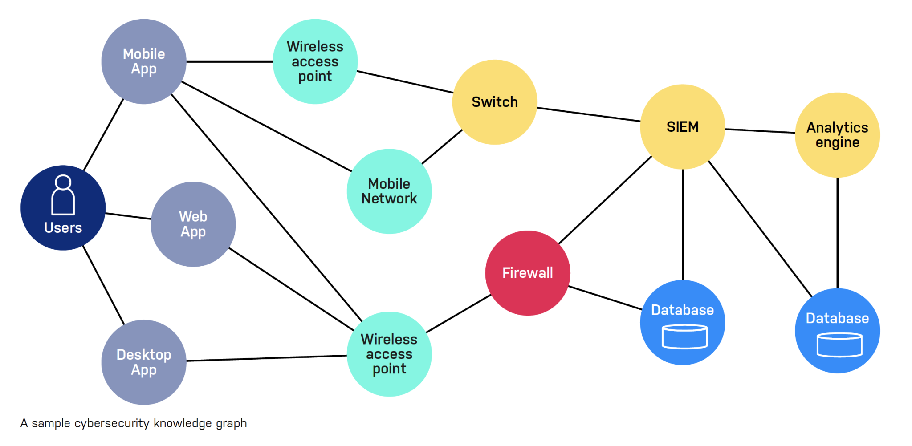

---
author:
  - Ausitn Rappa
source: Markdown
publisher: Publisher
permissions: Permissions
audience: Users
category: Category
keyword:
  - Keyword1
  - Keyword2
resourceid:
  - Resourceid1
  - Resourceid2
workflow: review
---

# Steps to Install

1. Download the latest Knox installer from [Veracity Downloads](https://downloads.veracity.io/knox).

2. Run the installer using the following command:
   ```
   sudo ./install-knox.sh
   ```

   !!! note
   
       Ensure you have the necessary administrative privileges before running the installer. Installing Knox Recovery may require changes to system settings and access to protected directories.

3. Review the following settings before proceeding:

   | Field          | Description                     | Default Value |
   | -------------- | ------------------------------- | ------------- |
   | Port           | Port Knox listens on            | 9443          |
   | Data Directory | Location for backup metadata    | /var/knox     |
   | Enable Logs    | Whether to enable debug logging | true          |

4. Continue with the installation process.

   