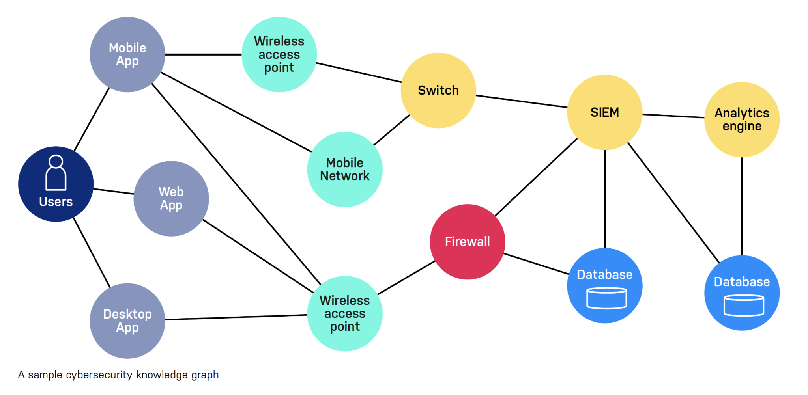

# Install Knox Recovery

Follow these steps to install Knox Recovery on your system.

## Prerequisites

Before installing Knox Recovery, verify that your environment meets the minimum system requirements.

## Procedure

1. Download the latest Knox installer from [Veracity Downloads](https://downloads.veracity.io/knox).

2. Run the installer using the following command:

   ```bash
   sudo ./install-knox.sh
   ```

   > [!NOTE]
   > Ensure you have administrative privileges before running the installer. Installing Knox Recovery requires system setting modifications and access to protected directories.

3. Review the default configuration settings before proceeding:

   The following table lists the default configuration settings for Knox.

   | Setting | Description | Default value |
   |:--|:--|:--|
   | Port | Port Knox listens on | 9443 |
   | Data directory | Location for backup metadata | /var/knox |
   | Enable logs | Whether to enable debug logging | true |

4. Complete the installation process.

   
